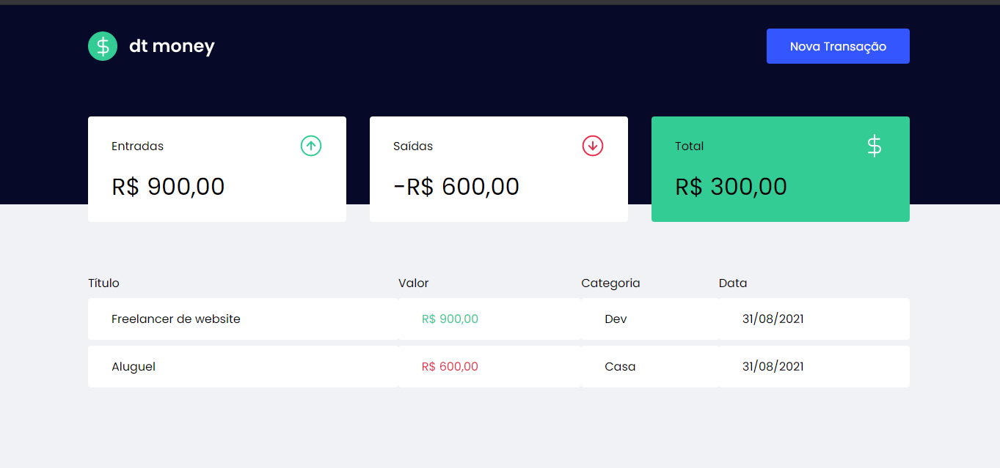
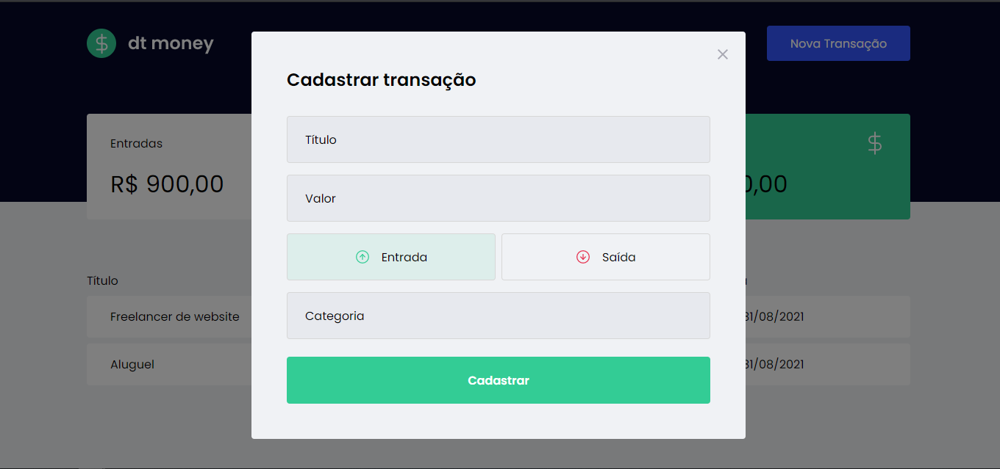

<p align="center" >

</p>


<h1 align="center">
     dt money
</h1>
<p align="center">💲 Application for personal finance control </p>


\
\
[](https://github.com/)
[](https://code.visualstudio.com/)
[](https://www.typescriptlang.org/)
[](https://www.figma.com/)
[](https://github.com/ellerbrock/open-source-badges/)

<a href="https://pt-br.reactjs.org/"></a>
<a href="https://github.com/onLeoRodrigues/dtmoney/issues"></a>
<a href="https://github.com/onLeoRodrigues/dtmoney/network"></a>
<a href="https://github.com/onLeoRodrigues/dtmoney/stargazers"></a>

Guide
=================
<!--ts-->
   * [About](#About)
   * [Project Status](#Project-Status)
   * [Features](#Features)
   * [Prerequisites](#Prerequisites)
   * [Running the application](#Running-the-application)
   * [Technologies](#Technologies)
   * [Author](#Author)
<!--te-->

## About

dt money is a project created for personal finance control, where you can find resources such as input and output of money, organized by name and category.
Project created in the chapter 1 of the IGNITE of the Rocketseat.


## Project Status


<h4 align="center"> 
	🚧  dtmoney 🚩 Under construction...  🚧
</h4>

## Features


- [x] Entry/Exit Registration
- [x] Input, Output and Total Calculation
- [ ] Login page

---
<h1 align="center">
  
  
</h1>


## Prerequisites

Before starting, you will need to have the following tools installed on your machine:
[Git](https://git-scm.com), [Node.js](https://nodejs.org/en/). 
Besides, it's nice to have an editor to work with code like [VSCode](https://code.visualstudio.com/)

## 🎲 Running the application

```bash
# Clone this repository
$ git clone https://github.com/onLeoRodrigues/dtmoney.git

# Access the project folder in the terminal/cmd
$ cd dtmoney

# Install dependencies
$ yarn build

# Run the application in development mode
$ yarn start

# The application will start at the port:3000 - access http://localhost:3000/
```
## 🛠 Technologies

The following tools were used in the construction of the project:

- [Node.js](https://nodejs.org/en/)
- [React](https://pt-br.reactjs.org/)
- [TypeScript](https://www.typescriptlang.org/)
- [Axios](https://axios-http.com/docs/intro)
- [MirageJs](https://miragejs.com/)                       
- [Polished](https://polished.js.org/)
- [Styled Components](https://styled-components.com/)  

## Author


<a href="https://bio.link/leorodriguesdev">
 
 <br />
 <sub><b>Leonardo Rodrigues</b></sub></a> <a href="https://bio.link/leorodriguesdev" title="link leo">⚡</a>


Made with ❤️ by Leonardo Rodrigues 👋🏽 Contact us!

[](https://twitter.com/leorodriguesdev) [](https://www.linkedin.com/in/on-leorodrigues/) 
[](mailto:leorodriguesoffice@gmail.com)
<p align="left" >

</p>