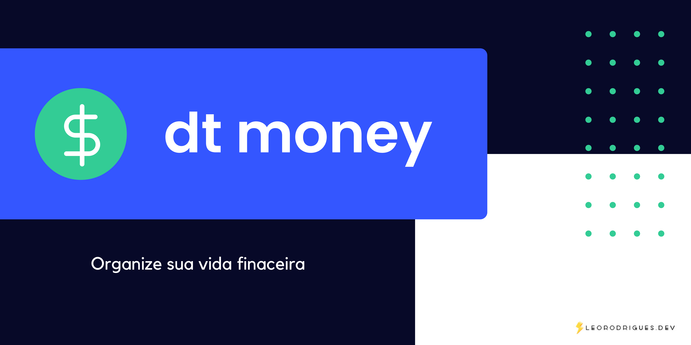

<a alt="README in english language" href="/README-en.md">Click here for README in english language &nbsp;&nbsp; ' </a>

<h1 align="center">
     dt money
</h1>

💲 Aplicação para controle pessoal de finanças 

Tabela de conteúdos
=================
<!--ts-->
   * [Sobre](#Sobre)
   * [Tabela de Conteudo](#tabela-de-conteudo)
   * [Instalação](#instalacao)
   * [Como usar](#como-usar)
      * [Pre Requisitos](#pre-requisitos)
      * [Local files](#local-files)
      * [Remote files](#remote-files)
      * [Multiple files](#multiple-files)
      * [Combo](#combo)
   * [Tests](#testes)
   * [Tecnologias](#tecnologias)
<!--te-->

<h4 align="center"> 
	🚧  dtmoney 🚀 Em construção...  🚧
</h4>

### Features

- [x] Cadastro de entrada/saída
- [x] Calculo de Entrada, Saída e Total
- [ ] Página de login

<h1 align="center">
  
</h1>